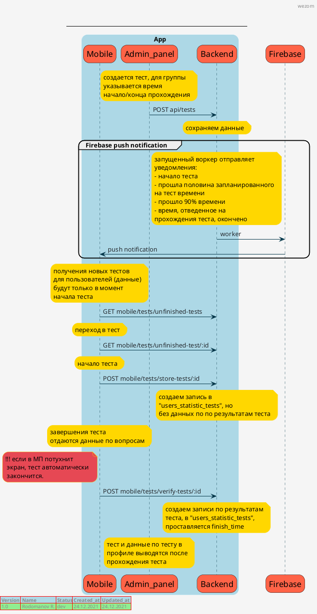

#tools #uml

```plantuml
@startuml

title
<u>Процесс прохождения теста</u>
end title

header
wezom
endheader

skinparam {
    TitleFontSize 25
    TitleFontName Courier
    TitleFontStyle underscore
    ArrowColor #033649
    ArrowFontColor #24292e
    BackgroundColor #f5f5f5
    BorderColor black
    RoundCorner 25
    SequenceLifeLineBorderColor #033649
    ParticipantFontSize 17
    BoxPadding 50
    SequenceBoxBorderColor '
}

skinparam note {
    BackgroundColor gold
    BorderColor gold
}

skinparam group {
    BackgroundColor red
    BorderColor black
}

skinparam participant {
    BorderColor black
    BackgroundColor tomato
}

box "App" #LightBlue
participant Mobile
participant Admin_panel
participant Backend
end box

participant Firebase

note over Admin_panel
создается тест, для группы
указывается время
начало/конца прохождения
endrnote
Admin_panel -> Backend: POST api/tests

note over Backend
сохраняем данные
endrnote

'START GROUP NOTIFICATION
group Firebase push notification
note over Backend
запущенный воркер отправляет
уведомления:
- начало теста
- прошла половина запланированного
на тест времени
- прошло 90% времени
- время, отведенное на
прохождения теста, окончено
endrnote

Backend -> Firebase : worker
Firebase -> Mobile : push notification
end
'END GROUP NOTIFICATION

note over Mobile
получения новых тестов
для пользователей (данные)
будут только в момент
начала теста
endrnote
Mobile -> Backend: GET mobile/tests/unfinished-tests


note over Mobile
переход в тест
endrnote
Mobile -> Backend: GET mobile/tests/unfinished-test/:id

note over Mobile
начало теста
endrnote
Mobile -> Backend: POST mobile/tests/store-tests/:id

note over Backend
создаем запись в
"users_statistic_tests", но
без данных по по результатам теста
endrnote

note over Mobile
завершения теста
отдаются данные по вопросам
endrnote
note left Mobile #e64854: !!! если в МП потухнит \n экран, тест автоматически \n закончится.
Mobile -> Backend: POST mobile/tests/verify-tests/:id


note over Backend
создаем записи по результатам
теста, в "users_statistic_tests",
проставляется finish_time
endrnote

note over Admin_panel
тест и данные по тесту в
профиле выводятся после
прохождения теста
endrnote


left footer
<#lightblue,#red>|= Version |= Name |= Status|= Created_at |= Updated_at |
<#lightgreen>| 1.0 | Rodomanov R. | dev | 24.12.2021 | 24.12.2021 |
endfooter

@enduml


```