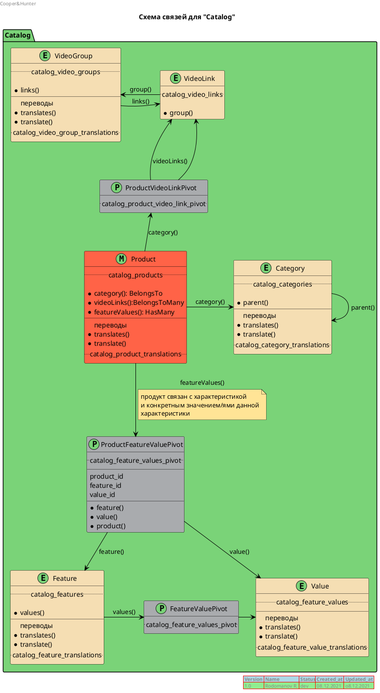

#tools #uml

```plantuml
@startuml

title
Cхема связей для "Catalog"
end title

left header
Cooper&Hunter
endheader

skinparam class {
    BackgroundColor Wheat
    BorderColor Black
}

skinparam stereotypeCBackgroundColor DimGray

'ПОЛЬЗОВАТЕЛЬ'
package Catalog #7ad378 {

    class Category <<(E,#7ad378)>> {
        .. catalog_categories ..

        *parent()
        __
        переводы
        *translates()
        *translate()
        .. catalog_category_translations ..
    }

    class Product <<(M,#7ad378)>> #tomato {
        .. catalog_products ..

        *category(): BelongsTo
        *videoLinks():BelongsToMany
        *featureValues(): HasMany
        __
        переводы
        *translates()
        *translate()
        .. catalog_product_translations ..
    }

    class VideoGroup <<(E,#7ad378)>> {
        .. catalog_video_groups ..

        *links()
        __
        переводы
        *translates()
        *translate()
        .. catalog_video_group_translations ..
    }

    class VideoLink <<(E,#7ad378)>> {
        .. catalog_video_links ..

        *group()
    }

    class ProductVideoLinkPivot <<(P,#7ad378)>> #a9abae {
        .. catalog_product_video_link_pivot ..
    }

    class Feature <<(E,#7ad378)>> {
        .. catalog_features ..

        *values()
        __
        переводы
        *translates()
        *translate()
        .. catalog_feature_translations ..
    }
    class Value <<(E,#7ad378)>> {
        .. catalog_feature_values ..
        __
        переводы
        *translates()
        *translate()
        .. catalog_feature_value_translations ..
    }

    class FeatureValuePivot <<(P,#7ad378)>> #a9abae {
        .. catalog_feature_values_pivot ..
    }

    class ProductFeatureValuePivot <<(P,#7ad378)>> #a9abae {
        .. catalog_feature_values_pivot ..
        __
        product_id
        feature_id
        value_id
        __
        *feature()
        *value()
        *product()
   }
}

Category -right[#black]-> Category: parent()
Product -right[#black]-> Category: category()

VideoGroup -right[#black]-> VideoLink: links()
VideoLink -left[#black]-> VideoGroup: group()

Product -up[#black]-> ProductVideoLinkPivot: category()
ProductVideoLinkPivot -up[#black]-> VideoLink: videoLinks()
ProductVideoLinkPivot -up[#black]-> VideoLink

Feature -right[#black]-> FeatureValuePivot: values()
FeatureValuePivot -right[#black]-> Value

Product -down[#black]-> ProductFeatureValuePivot: featureValues()
note on link #ffe496
продукт связан с характеристикой
и конкретным значением/ями данной
характеристики
end note
ProductFeatureValuePivot -down[#black]-> Feature: feature()
ProductFeatureValuePivot -down[#black]-> Value: value()

right footer
<#lightblue,#red>|= Version |= Name |= Status|= Created_at |= Updated_at |
<#lightgreen>| 1.0 | Rodomanov R. | dev | 08.12.2021 | o8.12.2021 |
endfooter

@enduml

```