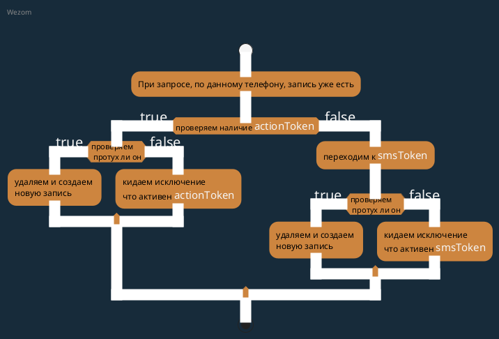

#tools #uml

```plantuml
@startuml

title
Запрос на смс верификацию
end title

left header
Wezom
endheader

skinparam title {
    FontName Courier
    FontColor f5f5f5
}

skinparam  {
    FontSize 13
    FontName Courier
    BorderColor black
    BackgroundColor 172b3a
    ArrowFontName Impact
    ArrowColor white
    ArrowFontColor f5f5f5
    ArrowFontSize 20
    ArrowThickness 16
}

skinparam activity {
    StartColor f5f5f5
    BarColor SaddleBrown
    EndColor f5f5f5
    BackgroundColor Peru
    BorderColor Peru
    DiamondBackgroundColor Peru
    DiamondBorderColor Peru
}

start
:При запросе, по данному телефону, запись уже есть;
if (проверяем наличие <size:15><color:f5f5f5>actionToken</color></size> ) then (true)
    if (проверяем \n протух ли он) then (true)
    :удаляем и создаем \nновую запись;
    else (false)
    :кидаем исключение \nчто активен <size:15><color:f5f5f5>actionToken</color></size>;
    endif
else (false)
:переходим к <size:15><color:f5f5f5>smsToken</color></size>;
 if (проверяем \n протух ли он) then (true)
    :удаляем и создаем \nновую запись;
    else (false)
    :кидаем исключение \nчто активен <size:15><color:f5f5f5>smsToken</color></size>;
    endif
endif
stop
@enduml
```