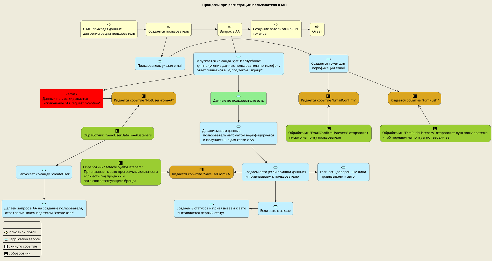

#tools #uml

```plantuml
@startuml

title
Процессы при регистрации пользователя в МП


end title

skinparam backgroundColor #EEEBDC
skinparam rectangle<<behavior>> {
    roundCorner 15
}
skinparam rectangle<<event>> {
    roundCorner 30
    backgroundColor GoldenRod
}
skinparam rectangle<<listener>> {
    roundCorner 30
    backgroundColor YellowGreen
}

sprite $Event [16x16/16] {
FFFFFFFFFFFFFFFF
FFFFFFFFFFFFFFFF
FF000000000FFFFF
FF000000000FFFFF
FF000FFFFFFFFFFF
FF000FFFFFFFFFFF
FF000000000FFFFF
FF000000000FFFFF
FF000FFFFFFFFFFF
FF000FFFFFFFFFFF
FF000000000FFFFF
FF000000000FFFFF
FFFFFFFFFFFFFFFF
FFFFFFFFFFFFFFFF
}
sprite $Listener [16x16/16] {
FFFFFFFFFFFFFFFF
FFFFFFFFFFFFFFFF
FF000FFFFFFFFFFF
FF000FFFFFFFFFFF
FF000FFFFFFFFFFF
FF000FFFFFFFFFFF
FF000FFFFFFFFFFF
FF000FFFFFFFFFFF
FF000FFFFFFFFFFF
FF000FFFFFFFFFFF
FF00000000000FFF
FF00000000000FFF
FFFFFFFFFFFFFFFF
FFFFFFFFFFFFFFFF
}

sprite $bProcess jar:archimate/business-process
sprite $aService jar:archimate/application-service
sprite $aEvent jar:archimate/application-component

rectangle "С МП приходят данные\nдля регистрации пользователя" as COME_DATA <<$bProcess>><<behavior>> #Business
rectangle "Создается пользователь" as CREATE_USER <<$bProcess>><<behavior>> #Business
rectangle "Запрос в АА" as REQUEST_TO_AA <<$bProcess>><<behavior>> #Business
rectangle "Создание авторизационых \nтокенов" as CREATE_TOKEN <<$bProcess>><<behavior>> #Business
rectangle "Ответ" as RESPONSE <<$bProcess>><<behavior>> #Business


COME_DATA -right->> CREATE_USER
CREATE_USER -right->> REQUEST_TO_AA
REQUEST_TO_AA -right->> CREATE_TOKEN
CREATE_TOKEN -right->> RESPONSE

'EMAIL VERIFY
rectangle "Пользователь указал email" as hasEmail <<$aService>><<behavior>> #Application
rectangle "Создается токен для \n верификации email" as CREATE_EMAIL_TOKEN <<$aService>><<behavior>> #Application
rectangle "Кидается событие "EmailConfirm"" as EVENT_CONFIRM_EMAIL <<$Event>><<event>>
rectangle "Кидается событие "FcmPush"" as EVENT_PUSH_CONFIRM_EMAIL <<$Event>><<event>>
rectangle "Обработчик "FcmPushListeners" отправляет пуш пользователю \n чтоб перешел на почту и по твердил ее" as PUSH_CONFIRM_EMAIL <<$Listener>><<listener>>
rectangle "Обработчик "EmailConfirmListeners" отправляет \n письмо на почту пользователя" as SEND_CONFIRM_EMAIL <<$Listener>><<listener>>

hasEmail <-up- CREATE_USER
hasEmail -left-> CREATE_EMAIL_TOKEN
CREATE_EMAIL_TOKEN -down-> EVENT_CONFIRM_EMAIL
CREATE_EMAIL_TOKEN -down-> EVENT_PUSH_CONFIRM_EMAIL
EVENT_PUSH_CONFIRM_EMAIL <-down- PUSH_CONFIRM_EMAIL
EVENT_CONFIRM_EMAIL <-down- SEND_CONFIRM_EMAIL

rectangle "Запускается команда "getUserByPhone" \n для получение данных пользователя по телефону \n ответ пишеться в бд под тегом "signup"" as COMMAND_GET_USER_BY_PHONE <<$aService>><<behavior>> #Application
rectangle "Данные по пользователю есть" as USER_EXIST <<$aService>><<behavior>> #lightgreen
rectangle "Данных нет, выкидывается \n исключение "AARequestException"" as USER_NOT_FOUND <<$test>><<error>> #red
rectangle "Кидается событие "NotUserFromAA"" as EVENT_CREATE_USER_TO_AA <<$Event>><<event>>
rectangle "Обработчик "SendUserDataToAAListeners" as LISTENER_SEND_USER_DATA_TO_AA <<$Listener>><<listener>>
rectangle "Запускает команду "createUser" as COMMAND_CREATE_USER <<$aService>><<behavior>> #Application
rectangle "Делаем запрос в АА на создание пользователя, \n ответ записываем под тегом "create user"" as SEND_TO_CREATE_USER <<$aService>><<behavior>> #Application

rectangle "Дозаписываем данные, \n пользователь автоматом верифицируется \n и получает uuid для связи с AA" as ADD_NEW_DATA_TO_USER <<$aService>><<behavior>> #Application
rectangle "Создаем авто (если пришли данные) \n и привязываем к пользователю" as CREATE_USER_CAR <<$aService>><<behavior>> #Application
rectangle "Кидается событие "SaveCarFromAA"" as EVENT_SAVE_CAR_AA <<$Event>><<event>>
rectangle "Обработчик "AttachLoyaltyListeners" \n Привязывает к авто программы лояльности \n если есть год продажи и \n авто соответствующего бренда" as LISTENER_ATTACH_LOYALTY <<$Listener>><<listener>>
rectangle "Если авто в заказе" as ORDER_CAR <<$aService>><<behavior>> #Application
rectangle "Создаем 8 статусов и привязываем к авто \n выставляется первый статус" as ORDER_CAR_STATUSES <<$aService>><<behavior>> #Application
rectangle "Если есть доверенные лица \n привязываем к авто" as CONFIDIANTS <<$aService>><<behavior>> #Application

REQUEST_TO_AA -down->> COMMAND_GET_USER_BY_PHONE
COMMAND_GET_USER_BY_PHONE -down->> USER_EXIST
COMMAND_GET_USER_BY_PHONE -down->> USER_NOT_FOUND
USER_EXIST -down->> ADD_NEW_DATA_TO_USER
USER_NOT_FOUND -right->> EVENT_CREATE_USER_TO_AA
EVENT_CREATE_USER_TO_AA <<-down- LISTENER_SEND_USER_DATA_TO_AA
LISTENER_SEND_USER_DATA_TO_AA -down->> COMMAND_CREATE_USER
COMMAND_CREATE_USER -down->> SEND_TO_CREATE_USER
ADD_NEW_DATA_TO_USER -down->> CREATE_USER_CAR
CREATE_USER_CAR -left->> EVENT_SAVE_CAR_AA
CREATE_USER_CAR -down->> ORDER_CAR
CREATE_USER_CAR -right->> CONFIDIANTS
EVENT_SAVE_CAR_AA <<-left- LISTENER_ATTACH_LOYALTY
ORDER_CAR -left->> ORDER_CAR_STATUSES

legend left

====
<$bProcess> :основной поток
====
<$aService> : application service
====
<$Event> : кинуто событие
====
<$Listener> : обработчик
endlegend
@enduml

```