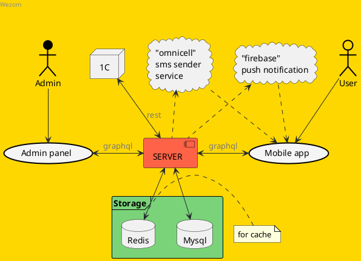

#tools #uml

```plantuml
@startuml
title
Общая схема приложения
end title

left header
Wezom
endheader

skinparam  {
    FontSize 13
    BackgroundColor<<Apache>> Red
    BorderColor<<Apache>> #FF6655
    FontName Courier
    BorderColor black
    BackgroundColor gold
    ArrowFontName Impact
    ArrowColor #24292e
    ArrowFontColor #777777
}

skinparam component {
    BorderColor black
    BackgroundColor tomato
}

skinparam title {
    FontName Courier
}

skinparam frame {
    BorderColor black
    BackgroundColor #7ad378
}

"Admin" as Admin #black;line:black;line.bold;text:black
"User" as User #gold;line:black;line.bold;text:black
"Mobile app" as (MApp) #f5f5f5;line:black;line.bold;text:black
"Admin panel" as (Admin-panel) #f5f5f5;line:black;line.bold;text:black

frame Storage {
    database db as "Mysql" {
    }
    database redis as "Redis" {
    }
}

node node as "1C" {
}

cloud sms_sender ["omnicell"
sms sender
service
]
cloud firebase ["firebase"
push notification
]

User -down-> (MApp)
[SERVER] <-right-> (MApp) : graphql

Admin -down-> (Admin-panel)
[SERVER] <-left-> (Admin-panel) : graphql

[SERVER] <-down-> db
[SERVER] <-down-> redis

note left of redis
for cache
end note

[SERVER] <-up-> node : rest

[SERVER] .up-> sms_sender
sms_sender .down-> (MApp)

[SERVER] .up-> firebase
firebase .down-> (MApp)

@enduml
```